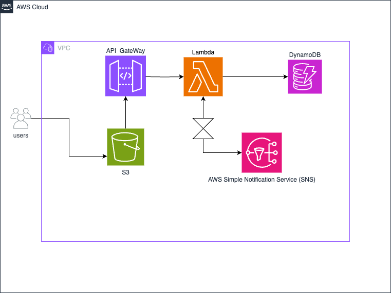

# FlexBook Final Project  :brain: 
Book an Appointment from a website that is hosted inside S3 Bucket, send the information to DynamoDB, you will get notified after each submission with service selected and the date  

You can start first with git clone to get a copy of the files on your local to be able to update the necessary code
## 1. Create DynamoDB Table :
- Partition key : is the first key id
- Sort key : the date value
Both Strings 

## 2. Create An IAM Role with these 5 Policies :
- AmazonAPIGatewayInvokeFullAccess
- AmazonDynamoDBFullAccess
- AmazonS3FullAccess
- AmazonS3ObjectLambdaExecutionRolePolicy
- AmazonSNSFullAccess

> This role will be late on linked with lambda to access DynamoDB and insert the data along with API gateway

## 3. Create an SNS Topic :
create A Standard SNS Topic & create a Subscribtion linked to the SNS topic 
- copy the SNS::ARN to insert it later in the lambda function 
- Confirm the Subscibtion via the email was sent to your inbox

## 4. create a lambda function :
when creating the lambda function chose an existing role the one you just have created with the policies above, with pyhton runtime 
in the code bit add the code in lambda.py and change the necessary :
1. in line 7 change the table name to match the name you created in DynamoDB
2. change the SNS Topic ARN to the one you have made
3. make sure the items match both the Partition key and sory key you created as well

## 5. Create An API Gateway:
- Create REAST API, name your api and click create 
- next create a Resource from the middle of the page 
- insert a name in the resource name & check the box for Enable CORS (Cross Origin Resource Sharing)
- chose the book resource you just created and click create method :
1.  chose method type: POST 
2. chose lambda & Link the lambda function you created : Create method
3. Now click on the /book resource again and click from the right on Enable CORS 
-  Check both Gateway response boxes 
- for Access-Control-Allow-Methods check Both:
1. OPTIONS
1. POST
 - for Access-Control-Allow-Headers
>Content-Type,X-Amz-Date,Authorization,X-Api-Key,X-Amz-Security-Token
- for Access-Control-Allow-Origin 
> use the wild card symbol:  * 

click Save

- now underneath /book chose POST and start with method response 

EDIT if already exists or create response
- HTTP status code : 200 
- Add three Headers from the next page : 
1. Access-Control-Allow-Origin
2. Access-Control-Allow-Methods
3. Access-Control-Allow-Origin
- Make sure there is a reponse body in the same page :
 Content type : application/json  
 Model : Empty 
 click Save
 in the method page it should show: 
 > Response headers (3)

 Now in the next tab Integration responses :
Click Edit 
in the Header mappings :
- Access-Control-Allow-Headers:
'Content-Type,X-Amz-Date,Authorization,X-Api-Key,X-Amz-Security-Token'
- Access-Control-Allow-Methods:
'POST,OPTIONS'
- Access-Control-Allow-Origin: '*'
all Values should be wrapped in single quotes 
next below in the mapping template :
content Type : application/json 
Template body : 
> { 
    "body": "$util.escapeJavaScript($input.body).replaceAll("\\'", "'")"
}

### Make sure there two back slashes not one in the code above inside the parenthese after replaceAll
click save 

Next tab is integration request :
- click edit and scroll below to mapping template :
- click add mapping template :
content Type : application/json 
Template body : 
> { 
    "body": "$util.escapeJavaScript($input.body).replaceAll("\\'", "'")"
}
### Make sure there two back slashes not one in the code above inside the parenthese after replaceAll
- next in the Method request tab click Edit
scroll down to HTTP request headers and click add headers :
name: Content-Type
- below click on add model in the request body tab 
Content-Type: application/json
click Save 
- now click on Deploy API after all changes have been added 
- in the window from the dropdown menu chose new stage, name the stage prod then click deploy 

in the new stages page click on the Plus sign + to open the resourse you had until you get to POST 
Copy and Invoke URL so you can add it to the html file in the fetch function 
now you can go and create you s3 bucket and upload the index.html 

## 6. Create An S3 Bucket to Host the index.html file
create the bucket an UnBlock the publick access 
-  from Properties tab Enable hosting a static website ( will find this at the bottom of the page )
-  fill the index input  with : index.html 
- in Permissions Tab go to Buckey policy and click Edit
- copy and paste the Bucket policy with the provided s3-bucket-policy.md file
- Change the Bucket ARN to your Bucket ARN in the policy 
Check the Policy bucket file you have from the git clone on you local and do the necessary changes to it 
- save the changes 
- before upaloding the html file you need to make couple changes :
1. paste the link you got after deploying and creating the stage it should look like this : 
https://randnomnumbers.execute-api.us-west-2.amazonaws.com/prod/book
- paste this link in the fetch function inside the html
2. make sure the json body -in line 35 - matches the keys you created in you DynamoDB Table
- save the changes
- upload the index.html file after all the changes you done

  
click on the object you just uploaded and locate the Object URL to open the hosted website

After implementing all the steps you can access the website form thep provided link from S3 Properties tab,
Try selecting a date and a service, check the alert message you prompted with 
then go to your dynamoDB table and check the newly inserted items in there 
After each submition you will recive an alert on the subscribed email with the appointment details 

## Test object you can try in Lambda
> {
  "body": "{\"serviceName\": \"home\", \"date\": \"2060\"}"
}

___
## Trouble shooting section 
Upon Submiting the booked date a falied message appears on the screen 

## TroubleShooting the issue :
- checking on the API endpoint with POSTMAN 

the returned message comes back successful accepting a json body, this might means one thing which there might be a correction needed in the python code providedto lambda functions 

> No data is stored yet 

aws cloudformation create-stack --stack-name ProjectStack --template-body file://setup.yaml --capabilities CAPABILITY_IAM --region us-west-2

curl -X POST https://idpxq46q97.execute-api.us-west-2.amazonaws.com/prod/bookdate\
-H "Content-Type: application/json" \
-d '{"dateId": "1234567890", "date": "2024-07-14"}'
webpack add_data.js --mode development --target web --devtool false -o main.js

### API Gateway configuration came after troublshooting through the network tab in the browser 
